# ApotekaApp - Sistem za upravljanje apotekom

Dobrodošli u **ApotekaApp** – aplikaciju namijenjenu za efikasno upravljanje radom apoteke, sa posebnim fokusom na korisničko iskustvo, personalizaciju i podršku za dva korisnička profila: **klijente** i **administratore**.

## Uvod

Ovaj priručnik je namijenjen svim korisnicima sistema ApotekaApp – klijentima i administratorima – i objašnjava kako koristiti aplikaciju za efikasno upravljanje radom apoteke. Aplikacija omogućava vođenje evidencije o proizvodima, kategorijama, narudžbama i korisnicima.

Klijenti mogu pregledavati i pretražiti proizvode po kategorijama, dodavati proizvode u korpu, vršiti online kupovinu. Administratori upravljaju proizvodima, kategorijama, narudžbama i računima.

Svi korisnici imaju pristup personalizaciji – mogu promijeniti temu interfejsa.

Aplikacija podržava dva tipa korisnika:

- **Klijent** – može pregledavati proizvode, vršiti kupovinu i pregledati svoje narudžbe
- **Administrator** – upravlja proizvodima, kategorijama, korisnicima i svim narudžbama

## Prijavljivanje na sistem

### Početni prozor

Nakon pokretanja aplikacije korisniku se prikazuje početni prozor sa opcijama za prijavu administrator i odabir teme i početak kupovine za korisnika.

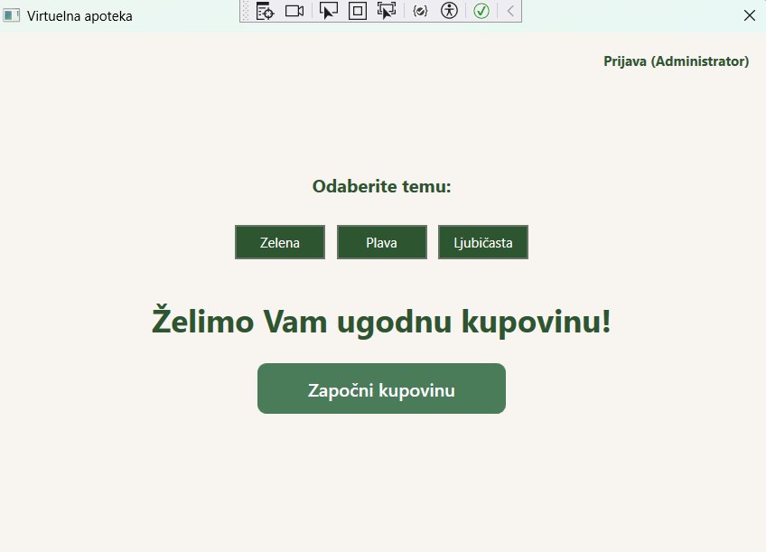

### Za klijente

Klikom na dugme "Započni kupovinu", otvara se prozor za online kupovinu gdje klijenti mogu pregledavati proizvode i vršiti kupovinu bez prijave.

### Za administratore

Klikom na dugme "Administrator", otvara se prozor za prijavu administratora.

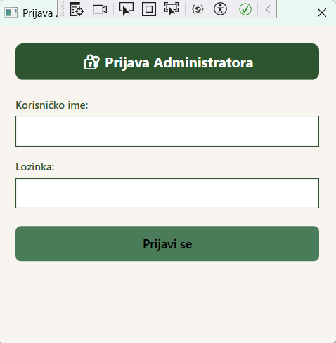

Ukoliko kredencijali nisu ispravni ili ukoliko neki od parametara nije unesen, pojavljuje se poruka koja to naznačava korisniku.

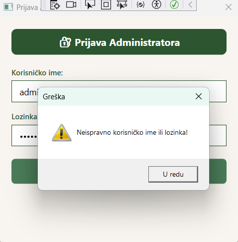
## Glavni meni

### Meni za klijente

Nakon ulaska u online kupovinu, klijentima se prikazuje glavni prozor sa tri glavna dijela:

**Lijevi panel - Kategorije**
- Prikaz svih dostupnih kategorija proizvoda
- Klikom na kategoriju prikazuju se proizvodi iz te kategorije

**Središnji panel - Proizvodi**
- Prikaz proizvoda iz odabrane kategorije
- Svaki proizvod prikazan je kao kartica sa nazivom, cijenom i dugmetom "Dodaj u korpu"

**Desni panel - Korpa**
- Prikaz svih proizvoda dodanih u korpu
- Mogućnost povećavanja/smanjivanja količine
- Ukupan iznos narudžbe
- Dugme "Završi kupovinu"

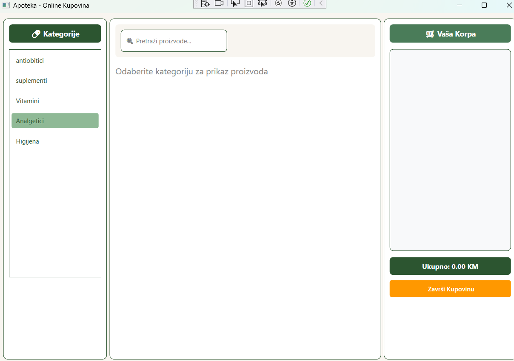

## Meni za administratore

Nakon prijave, administratorima se prikazuje glavni meni sa sljedećim opcijama:

- **Proizvodi** - prikaz svih proizvoda
- **Dodaj novi proizvod** - dodavanje novog proizvoda, pri dodavanju novog proizvoda može se dodati i nova kategorija i novi dobavljač
- **Pretraga proizvoda** - upravljanje proizvodima
- **Narudžbe** - pregled svih narudžbi
- **Pregled svih računa** - pregled svih računa

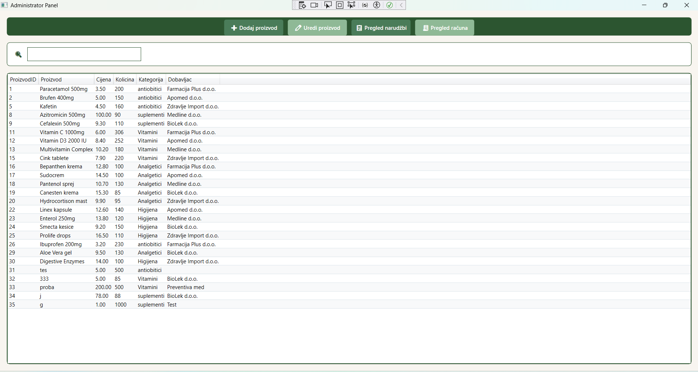

## Upravljanje proizvodima

### Pregled svih proizvoda

Administratori mogu pregledati kompletno stanje proizvoda u glavnom meniju. Prikazuje se lista svih proizvoda sa sljedećim informacijama:

- Naziv proizvoda
- Kategorija
- Cijena
- Količina na stanju
- Proizvođač
- Dobavljač

### Dodavanje novog proizvoda

Klikom na opciju "Dodaj novi proizvod" otvara se napredna forma za unos novog proizvoda:

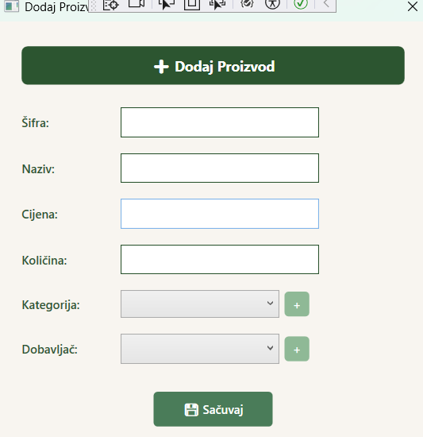

**Mogućnosti pri dodavanju proizvoda:**
- Unos osnovnih podataka (šifra, naziv, cijena, količina)
- Odabir postojeće kategorije iz padajućeg menija
- **Dodavanje nove kategorije** direktno iz forme
- Odabir postojećeg dobavljača iz padajućeg menija
- **Dodavanje novog dobavljača** direktno iz forme
- Čuvanje proizvoda u bazu podataka

### Dodavanje nove kategorije iz forme za proizvod

Prilikom dodavanja proizvoda, administrator može kreirati novu kategoriju:

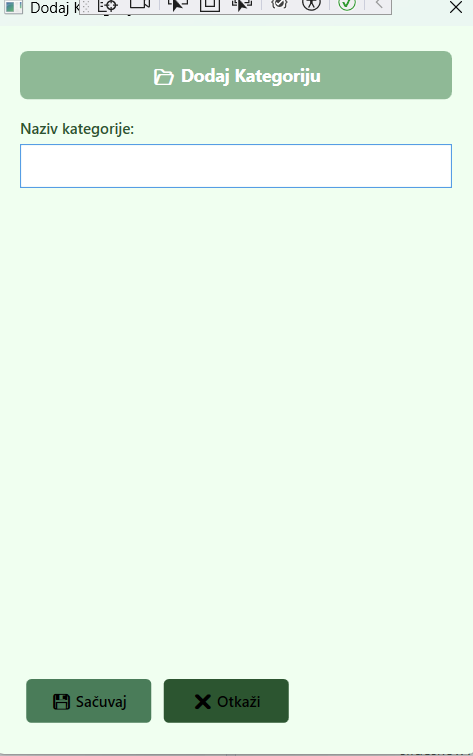

### Dodavanje novog dobavljača iz forme za proizvod

Prilikom dodavanja proizvoda, administrator može dodati novog dobavljača:

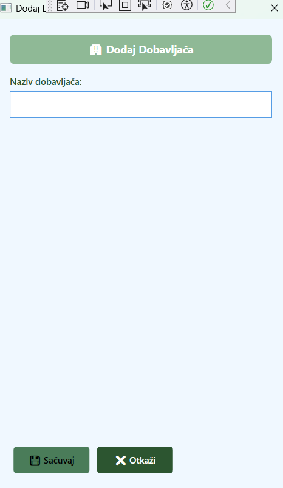

### Pretraga proizvoda

Administratori mogu pretraživati proizvode kroz opciju "Pretraga proizvoda":

**Mogućnosti pretrage:**
- Pretraga po nazivu proizvoda

### Izmjena proizvoda

Klikom na dugme "Uredi proizvod" moguće je izmijeniti cijenu i količinu proizvoda:

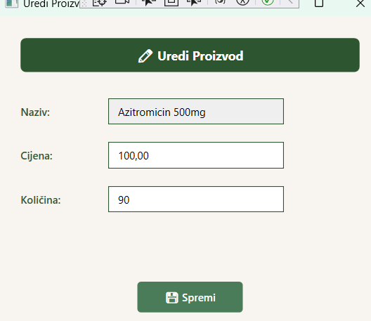

**Mogućnosti izmjene:**
- Promjena cijene proizvoda
- Ažuriranje količine na stanju

## Upravljanje narudžbama

Administratori mogu upravljati svim narudžbama kroz opciju "Narudžbe" u glavnom meniju.

### Pregled svih narudžbi

Prikazuje se kompletan spisak svih narudžbi u sistemu:

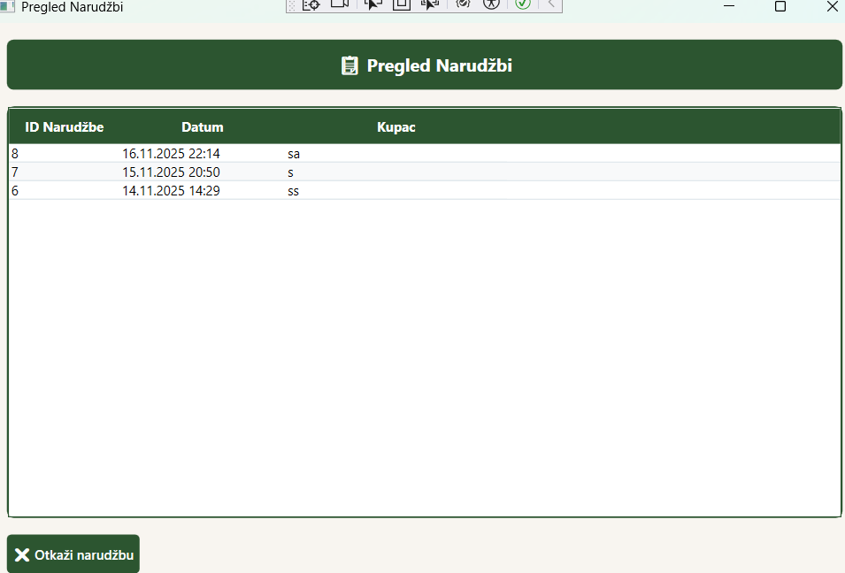

**Informacije uključuju:**
- Podatke o kupcu
- Ukupan iznos narudžbe
- Datum i vrijeme narudžbe
- Otkazivanje narudžbe

## Upravljanje računima

Administratori mogu pregledati sve račune kroz opciju "Pregled svih računa" u glavnom meniju.

### Pregled svih računa

Prikazuje se kompletna evidencija svih izdatih računa:

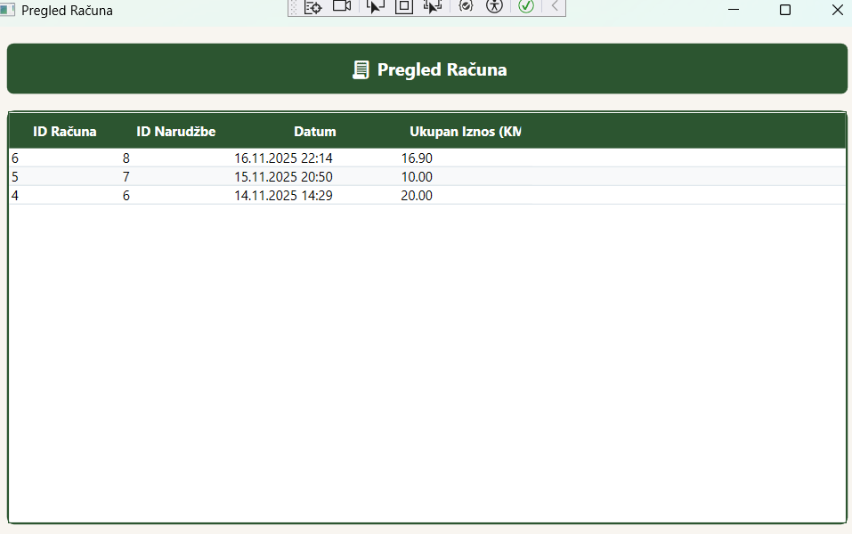

**Informacije uključuju:**
- Broj računa i datum izdavanja
- Ukupan iznos

### Online kupovina za klijente

Klijenti vrše kupovinu kroz glavni prozor za online kupovinu:

#### 1. Odabir kategorije
Klijent bira kategoriju proizvoda iz lijevog panela

#### 2. Pregled proizvoda
U središnjem panelu prikazuju se proizvodi iz odabrane kategorije

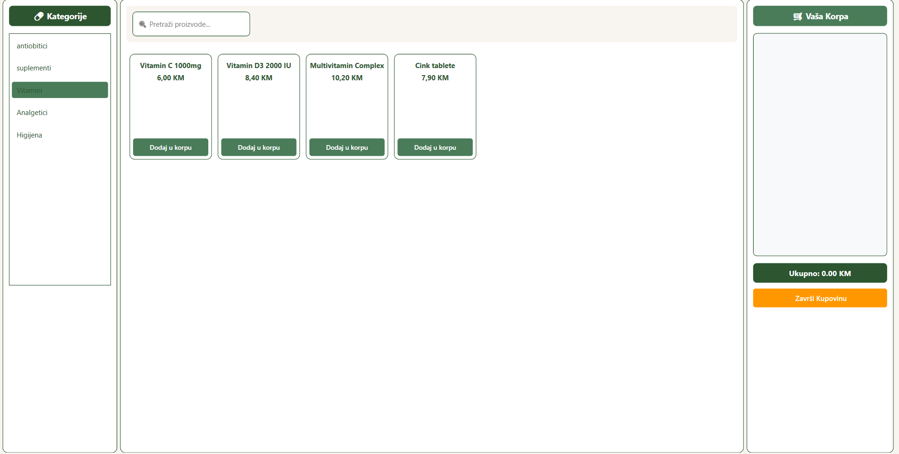

#### 3. Dodavanje u korpu
Klikom na "Dodaj u korpu" proizvod se dodaje u korpu

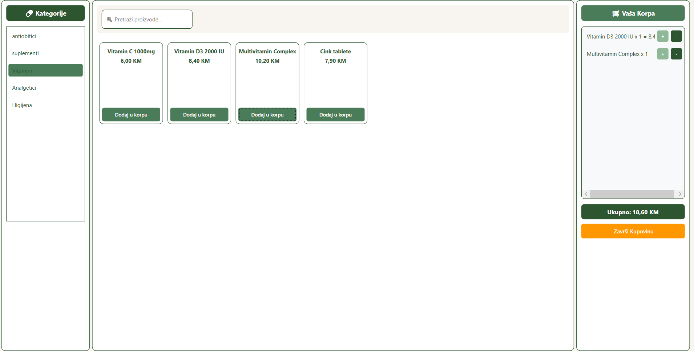

#### 4. Upravljanje korpom
U desnom panelu klijent može:
- Povećati/smanjiti količinu proizvoda
- Vidjeti ukupan iznos
- Završiti kupovinu

#### 5. Završetak kupovine
Klikom na "Završi kupovinu" otvara se prozor za unos podataka za dostavu i plaćanje:

## Pretraga proizvoda

Klijenti mogu pretraživati proizvode unutar odabrane kategorije koristeći polje za pretragu iznad liste proizvoda:

**Funkcionalnosti pretrage:**
- **Real-time pretraga** - rezultati se prikazuju odmah pri unosu teksta
- **Pretraga po nazivu** - sistem traži proizvode čiji naziv sadrži uneseni tekst
- **Očisti pretragu** - klikom na "❌" briše se unos i prikazuju svi proizvodi
- **Filtriranje rezultata** - prikaz samo relevantnih proizvoda

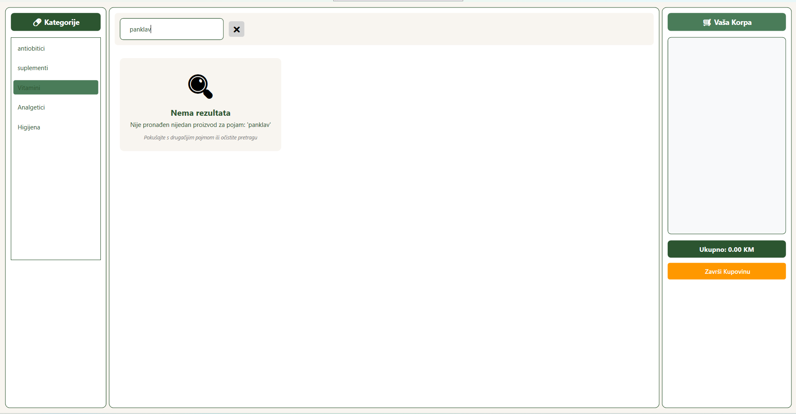

### Funkcionalnosti pretrage:
- **Real-time pretraga** - rezultati se prikazuju odmah pri unosu teksta
- **Pretraga po nazivu** - sistem traži proizvode čiji naziv sadrži uneseni tekst
- **Očisti pretragu** - klikom na "❌" briše se unos i prikazuju svi proizvodi

## Teme

Svi korisnici mogu promijeniti izgled aplikacije kroz odabir teme.

### Dostupne teme:
- **Plava tema** - defaultni izgled sa plavim akcentima
- **Zelena tema** - prirodni zeleni tonovi
- **Tamna tema** - tamni mod za ugodnije korišćenje noću

### Promjena teme:

#### Za klijente:
Tema se bira na početnom prozoru prije ulaska u kupovinu.

#### Za administratore:
Tema se bira na početnom prozoru prije ulaska u kupovinu.

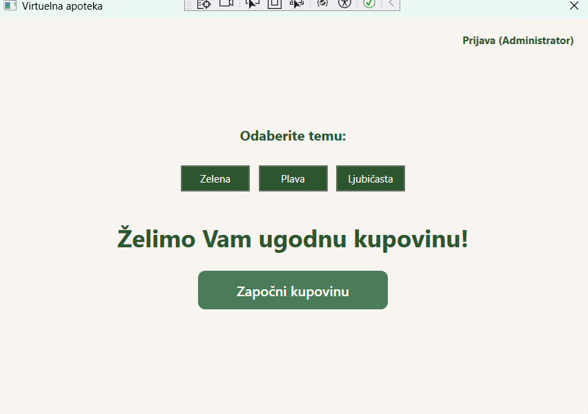

